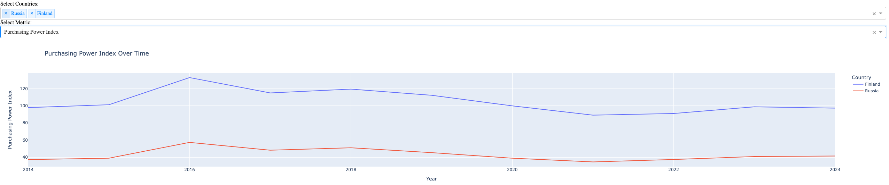

# Quality of Life Index Dashboard

## About the Project

This project consists of a Python script that scrapes quality of life data by country from the Numbeo website and a Dash application that visualizes this data in the form of interactive dashboards. 
The dashboards allow users to analyze and compare quality of life metrics across different countries over time.



## Getting Started

### Prerequisites

Before running the project, you need to ensure that Python 3 is installed on your system along with the following packages:

**MacOS/Linux:**
```sh
python -m venv venv && source venv/bin/activate && pip install -r requirements.txt
```

**Windows:**
```sh
python -m venv venv; .\venv\Scripts\Activate.ps1; pip install -r requirements.txt
```


### Usage

```sh
python main.py
```
Running main.py checks if a CSV file is present in the data folder.
If it is not present, it executes the scraper to retrieve the data and to create the csv file first. 
If the file is present, it runs the dash app.


In case you want to run the scraper and the dash app separately, you can do so by running the following commands:

To run the script that scrapes the data and generates the `.csv` file:
```sh
python quality_of_life_index_by_country.py
```
To start the Dash server and access the interactive dashboards:
```sh
python main.py
```

## Dashboards

The project includes several dashboards that allow users to:

- View the dynamic of quality of life index for selected countries from 2012 to 2024.
- Compare multiple countries based on various metrics such as:
  - Purchasing Power Index
  - Safety Index
  - Health Care Index
  - Cost of Living Index
  - Property Price to Income Ratio
  - Traffic Commute Time Index
  - Pollution Index
  - Climate Index
